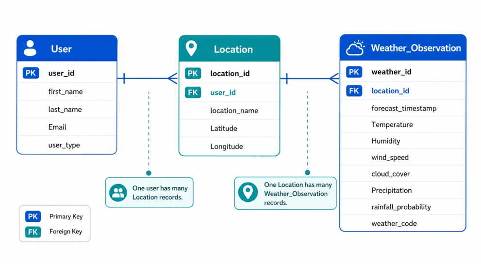

# Weather Database Schema Documentation

## Overview

This document describes the database schema used for the end-to-end weather data engineering pipeline. The database stores user-selected locations and weather forecast data loaded from the Open-Meteo API into Microsoft SQL Server for dashboard analysis and outdoor planning.

The schema is normalized to approximately Third Normal Form (3NF) by separating users, locations, and weather observations into related tables, avoiding repeated location data in each weather record, and linking tables through primary and foreign keys for efficient querying.

## Database Overview

The database contains three tables:

- `user`
- `location`
- `weather_observation`

## Entity Relationship Summary

| Table | Purpose |
|---|---|
| `user` | Stores dashboard user information and basic user classification for the system audience. |
| `location` | Stores selected locations and geographic coordinates used in Open-Meteo API requests. |
| `weather_observation` | Stores hourly or daily weather forecast metrics used for dashboard KPIs, trend charts, and outdoor planning indicators. |

## Table Documentation

### `user`

**Purpose**

Stores information about the person or organization using the dashboard. The proposal identifies likely users as residents, commuters, outdoor planners, and local organizations.

**Primary Key**

- `user_id`

**Relationships**

- One `user` can relate to many `location` records.
- Referenced by `location.user_id`.

**Table Structure**

| Column Name | Data Type | Key | Description |
|---|---|---|---|
| `user_id` | INTEGER | Primary Key | Unique user identifier |
| `first_name` | TEXT |  | User first name |
| `last_name` | TEXT |  | User last name |
| `email` | TEXT | Unique | User email address |
| `user_type` | TEXT |  | User category such as resident, commuter, outdoor planner, or organization |

### `location`

**Purpose**

Stores the selected locations used by the pipeline and dashboard. This table supports normalization by separating repeated coordinate and place information from the weather records.

**Primary Key**

- `location_id`

**Foreign Keys**

- `user_id` -> `user.user_id`

**Relationships**

- Many `location` records can belong to one `user`.
- One `location` can relate to many `weather_observation` records.
- Referenced by `weather_observation.location_id`.

**Constraints**

- Unique combination of `location_name`, `latitude`, and `longitude` to reduce duplicate saved locations.

**Table Structure**

| Column Name | Data Type | Key | Description |
|---|---|---|---|
| `location_id` | INTEGER | Primary Key | Unique location identifier |
| `user_id` | INTEGER | Foreign Key | Links the location to a user |
| `location_name` | TEXT |  | Name of the selected city or place |
| `latitude` | DECIMAL(8,5) |  | Latitude used in the API request |
| `longitude` | DECIMAL(8,5) |  | Longitude used in the API request |

### `weather_observation`

**Purpose**

Stores the weather forecast data retrieved from the Open-Meteo API and loaded into Microsoft SQL Server for dashboard analysis. This table supports the project deliverables of KPI cards, temperature trend charts, precipitation totals, and outdoor planning indicators.

**Forecast data includes**

- temperature
- humidity
- wind speed
- cloud cover
- precipitation
- rainfall probability
- hourly timestamps
- weather code

**Primary Key**

- `weather_id`

**Foreign Keys**

- `location_id` -> `location.location_id`

**Relationships**

- Many `weather_observation` records can belong to one `location`.
- Each weather record is associated with one selected location used for analysis and dashboard display.

**Table Structure**

| Column Name | Data Type | Key | Description |
|---|---|---|---|
| `weather_id` | INTEGER | Primary Key | Unique weather record identifier |
| `location_id` | INTEGER | Foreign Key | Links the weather record to a location |
| `forecast_timestamp` | DATETIME |  | Timestamp for hourly or daily forecast values |
| `temperature` | DECIMAL(5,2) |  | Temperature value used in KPI cards and trend charts |
| `humidity` | DECIMAL(5,2) |  | Humidity value returned by the API |
| `wind_speed` | DECIMAL(5,2) |  | Wind condition value used in dashboard planning views |
| `cloud_cover` | DECIMAL(5,2) |  | Cloud cover metric returned by the API |
| `precipitation` | DECIMAL(5,2) |  | Precipitation amount used in rainfall charts and summaries |
| `rainfall_probability` | DECIMAL(5,2) |  | Rainfall probability used in dashboard KPI cards |
| `weather_code` | INTEGER |  | WMO weather condition code |

## Cardinality Relationships

| Parent Table | Child Table | Relationship Type |
|---|---|---|
| `user` | `location` | One-to-Many |
| `location` | `weather_observation` | One-to-Many |

## Normalization Notes

This schema is normalized to approximately Third Normal Form:

- Repeating user information is separated into `user`.
- Repeating location and coordinate data is separated into `location`.
- Weather metrics are stored in `weather_observation` and linked to a location through a foreign key.
- Non-key attributes depend on the key of their own table rather than on another non-key field.

## ER Diagram

## Data Source

Weather forecast data is sourced from the Open-Meteo API, which the proposal identifies as the project's primary data source. The API provides hourly weather data, temperature values, humidity values, wind speed values, cloud cover values, precipitation values, weather codes, and coordinate-based forecast retrieval using latitude and longitude.

## Example Relationship Flow

- A user selects a location such as Louisville, Kentucky.
- That saved record is stored in `location` with its latitude and longitude.
- The ETL pipeline pulls forecast data for that location from Open-Meteo and stores each time-based record in `weather_observation`.
- The dashboard then queries `weather_observation` by `location_id` to generate KPI cards, temperature trend lines, precipitation totals, and outdoor planning indicators.

This design reduces duplication, supports the ETL workflow described in the proposal, and provides a clear structure for SQL-based dashboard querying.
